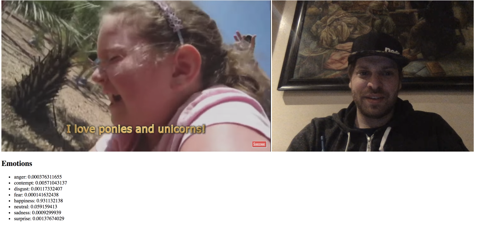

# lolchallenge

Try to laugh challenge based on stupid Youtube videos and Azure Cognitives Service Emotion API

# Run it locally

* Clone the repo
* `npm install`
* Enter your Azure Cognitive Emotion API Key inside the `package.json` file in the start task
* `npm start`
* Open [Http://localhost:3000](http://locahost:3000)